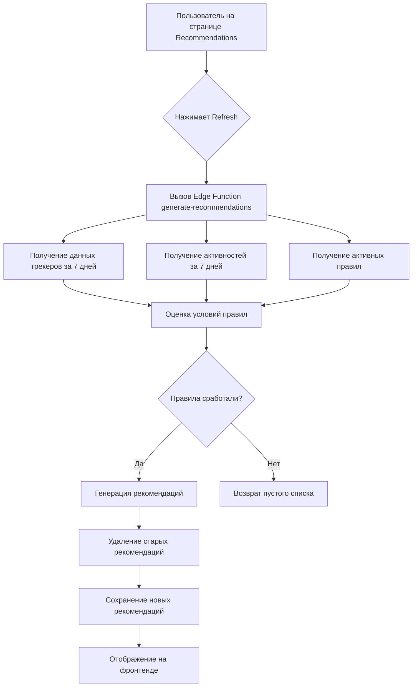

# Wellness Tracker - Приложение для отслеживания благополучия

## 📋 Описание проекта

Wellness Tracker - это современное веб-приложение для отслеживания психологического и эмоционального благополучия. Приложение помогает пользователям мониторить настроение, эмоции, уровень стресса, тревожности и энергии, планировать активности, вести дневник и получать персонализированные рекомендации на основе собранных данных.

**URL проекта**: https://lovable.dev/projects/00d436fb-fa77-4f0a-89d6-ea0a04b5d638

## 🚀 Основные возможности

### 1. **Система аутентификации**
- Регистрация и вход пользователей
- Восстановление пароля
- Защищенные маршруты
- Управление профилем пользователя

### 2. **Трекеры благополучия**
- **Трекер настроения** (Mood Tracker) - отслеживание текущего эмоционального состояния
- **Трекер эмоций** (Emotions Tracker) - фиксация конкретных эмоций (радость, грусть, злость и т.д.)
- **Трекер стресса** (Stress Tracker) - мониторинг уровня стресса
- **Трекер тревожности** (Anxiety Tracker) - отслеживание уровня тревожности
- **Трекер энергии** (Energy Tracker) - контроль энергетического уровня
- **Трекеры удовлетворенности** (Satisfaction Trackers) - оценка удовлетворенности различными сферами жизни

### 3. **Календарь активностей**
- Планирование и отслеживание активностей
- Просмотр по дням/списком
- Отметка выполнения активностей
- Детальная информация о каждой активности
- Интеграция с трекерами настроения

### 4. **Шаблоны активностей**
- Библиотека готовых шаблонов активностей
- Категоризация по типам (физическая активность, медитация, хобби и т.д.)
- Быстрое добавление активностей из шаблонов
- Фильтрация по категориям

### 5. **Дневник (Journal)**
- Ведение личного дневника
- Просмотр истории записей
- Статистика и инсайты по записям

### 6. **Аналитика и инсайты**
- Визуализация данных трекеров (графики, диаграммы)
- Анализ паттернов настроения и энергии
- Распределение эмоций
- Статистика выполнения активностей
- Корреляция между активностями и эмоциональным состоянием

### 7. **Система рекомендаций**
- Персонализированные рекомендации на основе данных пользователя
- Автоматическая генерация рекомендаций через Edge Functions
- Приоритизация рекомендаций

### 8. **Тесты и упражнения**
- Психологические тесты
- Практические упражнения
- Отслеживание прогресса

### 9. **Онбординг**
- Пошаговое знакомство с приложением
- Настройка профиля
- Установка целей
- Настройка напоминаний

### 10. **Многоязычность**
- Поддержка английского (EN)
- Поддержка русского (RU)
- Поддержка французского (FR)
- Автоматическое определение языка браузера
- Переключение языка в настройках

### 11. **Настройки и персонализация**
- Темы оформления (светлая/темная/авто)
- Цветовые схемы
- Размер шрифта
- Режим высокой контрастности
- Режим уменьшенной анимации
- Настройки уведомлений
- Управление данными и приватностью

## 🏗️ Архитектура проекта

### Фронтенд архитектура

#### **Технологический стек**
- **React 18.3** - библиотека для построения пользовательского интерфейса
- **TypeScript** - типизированный JavaScript для повышения надежности кода
- **Vite** - быстрый сборщик и dev-сервер
- **React Router v6** - маршрутизация на стороне клиента
- **TanStack Query (React Query)** - управление серверным состоянием и кэширование
- **Tailwind CSS** - utility-first CSS фреймворк
- **shadcn/ui** - библиотека компонентов на базе Radix UI
- **Recharts** - библиотека для построения графиков и диаграмм
- **i18next** - интернационализация
- **React Hook Form** - управление формами
- **Zod** - валидация схем данных
- **date-fns** - работа с датами

#### **Структура фронтенда**

```
src/
├── components/           # Переиспользуемые компоненты
│   ├── ui/              # Базовые UI компоненты (shadcn/ui)
│   ├── layout/          # Компоненты макета (навигация, лейаут)
│   ├── dashboard/       # Компоненты дашборда
│   ├── calendar/        # Компоненты календаря
│   ├── insights/        # Компоненты аналитики
│   ├── journal/         # Компоненты дневника
│   ├── tracker-history/ # Компоненты истории трекеров
│   ├── activity-templates/ # Компоненты шаблонов активностей
│   ├── onboarding/      # Компоненты онбординга
│   ├── profile/         # Компоненты профиля
│   ├── settings/        # Компоненты настроек
│   └── common/          # Общие компоненты (ErrorBoundary, LoadingSpinner)
│
├── pages/               # Страницы приложения
│   ├── auth/           # Страницы аутентификации
│   ├── Dashboard.tsx   # Главная страница
│   ├── Calendar.tsx    # Страница календаря
│   ├── Insights.tsx    # Страница аналитики
│   ├── Journal.tsx     # Страница дневника
│   ├── TrackerHistory.tsx # История трекеров
│   └── ...             # Другие страницы
│
├── contexts/            # React контексты
│   ├── AuthContext.tsx # Контекст аутентификации
│   └── ThemeContext.tsx # Контекст темы
│
├── hooks/               # Кастомные хуки
│   ├── useLocale.ts    # Хук для локализации
│   ├── use-mobile.tsx  # Хук для определения мобильных устройств
│   └── use-toast.ts    # Хук для тостов
│
├── integrations/        # Интеграции
│   └── supabase/       # Клиент и типы Supabase
│
├── locales/             # Файлы переводов
│   ├── en/             # Английский
│   ├── ru/             # Русский
│   └── fr/             # Французский
│
├── utils/               # Утилиты
├── lib/                 # Библиотеки и хелперы
├── App.tsx              # Корневой компонент
├── main.tsx             # Точка входа
├── i18n.ts              # Конфигурация i18n
└── index.css            # Глобальные стили и дизайн-система
```

#### **Паттерны и подходы**

1. **Компонентная архитектура**
   - Разделение на презентационные и контейнерные компоненты
   - Переиспользуемые UI компоненты из shadcn/ui
   - Композиция компонентов

2. **Управление состоянием**
   - Локальное состояние через `useState` и `useReducer`
   - Глобальное состояние через React Context (Auth, Theme)
   - Серверное состояние через TanStack Query
   - Формы через React Hook Form

3. **Типизация**
   - Строгая типизация TypeScript
   - Типы генерируются автоматически из Supabase схемы
   - Валидация через Zod схемы

4. **Дизайн-система**
   - Централизованная система токенов в `index.css`
   - Semantic color tokens (primary, secondary, accent, etc.)
   - Поддержка светлой/темной темы
   - Использование CSS переменных
   - Tailwind конфигурация в `tailwind.config.ts`

5. **Маршрутизация**
   - Декларативная маршрутизация через React Router
   - Защищенные маршруты через `ProtectedRoute` компонент
   - Ленивая загрузка страниц (где применимо)

### Бэкенд архитектура

#### **Технологический стек**
- **Lovable Cloud (Supabase)** - Backend-as-a-Service платформа
- **PostgreSQL** - реляционная база данных
- **Row Level Security (RLS)** - защита данных на уровне строк
- **Edge Functions** - serverless функции на Deno
- **Supabase Auth** - система аутентификации
- **Supabase Storage** - хранилище файлов

#### **Структура базы данных**

##### **Основные таблицы:**

1. **profiles** - профили пользователей
   - Хранит дополнительную информацию о пользователях
   - Связана с `auth.users` через `user_id`
   - Поля: full_name, avatar_url, настройки темы и т.д.

2. **tracker_entries** - записи трекеров
   - Хранит все данные трекеров (настроение, эмоции, стресс, энергия и т.д.)
   - Связана с пользователем через `user_id`
   - Временные метки для анализа паттернов

3. **activities** - активности пользователя
   - Запланированные и выполненные активности
   - Категоризация, описание, временные рамки
   - Связь с шаблонами активностей

4. **activity_templates** - шаблоны активностей
   - Предопределенные шаблоны активностей
   - Многоязычные названия и описания
   - Категории и иконки

5. **recommendation_rules** - правила для рекомендаций
   - Условия триггеров (пороги трекеров, дефицит активностей)
   - Связанные шаблоны активностей
   - Приоритеты и статусы

6. **user_recommendations** - персональные рекомендации
   - Сгенерированные рекомендации для пользователей
   - Статусы (принято/отклонено)
   - Время истечения

7. **journal_entries** - записи дневника
   - Текстовые записи пользователей
   - Временные метки

8. **tests** - психологические тесты
   - Определения тестов
   - Многоязычный контент

9. **test_results** - результаты тестов
   - Результаты прохождения тестов пользователями
   - Баллы и анализ

10. **exercises** - упражнения
    - Практические упражнения для пользователей
    - Инструкции и категории

#### **Row Level Security (RLS) политики**

Все таблицы защищены RLS политиками:
- Пользователи могут читать только свои данные (`user_id = auth.uid()`)
- Пользователи могут создавать записи только от своего имени
- Пользователи могут обновлять и удалять только свои записи
- Публичные данные (templates) доступны всем для чтения

#### **Edge Functions**

1. **generate-recommendations**
   - Анализирует данные пользователя (трекеры, активности)
   - Оценивает правила рекомендаций
   - Генерирует персонализированные рекомендации
   - Автоматически запускается по расписанию или по запросу

#### **Функции базы данных**

1. **handle_new_user()** - триггерная функция
   - Автоматически создает профиль при регистрации пользователя
   - Инициализирует начальные данные

2. **handle_updated_at()** - триггерная функция
   - Автоматически обновляет `updated_at` при изменении записей

#### **Storage Buckets**

1. **avatars** - публичное хранилище
   - Аватары пользователей
   - Публичный доступ на чтение
   - Загрузка только для владельца

#### **Безопасность**

1. **Аутентификация**
   - Email/Password аутентификация
   - Автоподтверждение email (для разработки)
   - JWT токены для авторизации

2. **Авторизация**
   - RLS политики на всех таблицах
   - Проверка `auth.uid()` для доступа к данным
   - Изоляция данных между пользователями

3. **Валидация**
   - Валидация на уровне базы данных (constraints, triggers)
   - Валидация на уровне приложения (Zod schemas)

## 📅 Детальное описание системы активностей и календаря

### Обзор функциональности

Система активностей и календаря - это один из ключевых модулей приложения, позволяющий пользователям планировать, отслеживать и анализировать свои ежедневные активности. Система помогает формировать здоровые привычки, отслеживать их выполнение и понимать влияние различных активностей на эмоциональное состояние.

### 🗓️ Календарь активностей

#### Основные возможности

1. **Два режима просмотра**
   - **Режим списка (List View)** - линейное представление активностей с группировкой по времени суток
   - **Режим календаря (Calendar View)** - месячный вид с визуальными индикаторами активностей

2. **Навигация по датам**
   - Переключение между неделями (кнопки влево/вправо)
   - Быстрый переход к текущей дате (кнопка "Сегодня")
   - Выбор конкретной даты в календарном виде

3. **Адаптивный дизайн**
   - Полностью responsive интерфейс для desktop, tablet и mobile
   - Оптимизированная раскладка для всех размеров экранов
   - Адаптивные spacing и typography с использованием CSS переменных

#### Режим списка (ListView)

**Компоненты:** `src/pages/Calendar.tsx`, `src/components/calendar/ListView.tsx`

**Функциональность:**
- Отображение активностей текущего дня с группировкой по времени суток:
  - **Утро (Morning)** - 06:00-12:00
  - **День (Day)** - 12:00-18:00
  - **Вечер (Evening)** - 18:00-00:00
  - **В любое время (Anytime)** - активности без конкретного времени

- **Горизонтальный селектор дней недели:**
  - Визуальное отображение текущей недели
  - Индикация выбранного дня
  - Индикаторы выполнения для каждого дня
  - Быстрое переключение между днями

- **Карточки активностей** (`ActivityItem` компонент):
  - Чекбокс для отметки выполнения
  - Категория с emoji-иконкой
  - Название активности
  - Время начала и продолжительность
  - Цветовая индикация типа влияния (positive/negative/neutral/mixed)
  - Collapsible секция с подробным описанием
  - Кнопка для открытия детальной модалки

- **Статистика выполнения:**
  - Счетчик выполненных активностей
  - Процент завершения
  - Визуальная индикация прогресса

**Realtime обновления:**
```typescript
// ListView подписывается на изменения в таблице activities
const channel = supabase
  .channel('activities-changes')
  .on('postgres_changes', {
    event: '*',
    schema: 'public',
    table: 'activities',
    filter: `user_id=eq.${user.id}`
  }, () => {
    fetchActivities(); // Перезагрузка данных
  })
  .subscribe();
```

#### Режим календаря (CalendarView)

**Компоненты:** `src/components/calendar/CalendarView.tsx`

**Функциональность:**
- Месячный календарный вид с недельной сеткой (понедельник - воскресенье)
- Визуальные индикаторы для каждого дня:
  - **Цветные точки** - отображение первых 3 активностей с цветовой кодировкой по типу влияния
  - **Круговой индикатор прогресса** - процент выполнения активностей за день
  - **Выделение текущего дня** - пульсирующая анимация и border
  - **Выделение выбранной даты** - акцентный background и shadow
  - **Затемнение дней вне текущего месяца** - сниженная opacity

**Цветовая схема влияния активностей:**
```typescript
const IMPACT_COLORS = {
  positive: 'bg-accent',      // Позитивное влияние (зеленый оттенок)
  negative: 'bg-destructive',  // Негативное влияние (красный оттенок)
  neutral: 'bg-muted-foreground', // Нейтральное влияние (серый оттенок)
  mixed: 'bg-warning'         // Смешанное влияние (желтый оттенок)
};
```

**Интерактивность:**
- Клик по дате переключает выбранную дату и обновляет режим списка
- Hover эффекты с scale трансформациями
- Плавные transitions с использованием adaptive CSS переменных

### 📋 Управление активностями

#### Добавление активности (`ActivityFormModal`)

**Компонент:** `src/components/calendar/ActivityFormModal.tsx`

**Поля формы:**
1. **Название** (обязательное)
   - Текстовое поле для краткого описания активности

2. **Описание** (опциональное)
   - Многострочное текстовое поле для детальной информации

3. **Категория** (обязательное)
   - Dropdown с предопределенными категориями:
     - Physical (Физическая активность) 🏃
     - Mental (Ментальная активность) 🧠
     - Social (Социальная активность) 👥
     - Hobby (Хобби) 🎨
     - Work (Работа) 💼
     - Rest (Отдых) 😴
     - Other (Другое) ⚡

4. **Дата** (обязательное)
   - Date picker с календарем
   - По умолчанию текущая дата или выбранная в календаре

5. **Тип влияния** (обязательное)
   - Кнопки выбора:
     - Positive (Позитивное) - зеленый цвет
     - Negative (Негативное) - красный цвет
     - Neutral (Нейтральное) - серый цвет
     - Mixed (Смешанное) - желтый цвет

6. **Весь день** (переключатель)
   - Если включен, скрывает поля времени начала и продолжительности

7. **Время начала** (условное)
   - Time picker для выбора времени
   - Отображается если "Весь день" выключен

8. **Продолжительность** (условное)
   - Числовое поле в минутах
   - Отображается если "Весь день" выключен

9. **Напоминание** (опциональное)
   - Переключатель включения напоминания
   - Поле для выбора времени напоминания (минуты до начала)

**Логика сохранения:**
```typescript
const handleSubmit = async () => {
  // Валидация данных
  if (!formData.title || !formData.category) {
    toast.error('Заполните обязательные поля');
    return;
  }

  // Подготовка данных
  const activityData = {
    user_id: user.id,
    title: formData.title,
    description: formData.description,
    category: formData.category,
    date: format(formData.date, 'yyyy-MM-dd'),
    start_time: formData.isAllDay ? null : formData.startTime,
    duration_minutes: formData.isAllDay ? null : formData.duration,
    impact_type: formData.impactType,
    reminder_enabled: formData.reminderEnabled,
    reminder_minutes_before: formData.reminderMinutes,
    status: 'planned'
  };

  // Сохранение в базу данных
  if (activity?.id) {
    // Обновление существующей активности
    await supabase
      .from('activities')
      .update(activityData)
      .eq('id', activity.id);
  } else {
    // Создание новой активности
    await supabase
      .from('activities')
      .insert(activityData);
  }
};
```

#### Просмотр деталей активности (`ActivityDetailModal`)

**Компонент:** `src/components/calendar/ActivityDetailModal.tsx`

**Отображаемая информация:**
- Emoji категории и полное название
- Детальное описание
- Дата в читаемом формате
- Время начала и окончания (если указано)
- Продолжительность
- Статус выполнения (Запланировано/Выполнено)
- Тип влияния с цветовой индикацией

**Действия:**
- **Редактировать** - открывает `ActivityFormModal` в режиме редактирования
- **Удалить** - показывает AlertDialog с подтверждением удаления

**Логика удаления:**
```typescript
const handleDelete = async () => {
  const { error } = await supabase
    .from('activities')
    .delete()
    .eq('id', activity.id);

  if (!error) {
    toast.success('Активность удалена');
    onOpenChange(false);
    onUpdate();
  }
};
```

#### Отметка выполнения (`ActivityItem`)

**Компонент:** `src/components/calendar/ActivityItem.tsx`

**Функциональность:**
- Checkbox для быстрой отметки выполнения
- Визуальная индикация статуса (зачеркивание, изменение opacity)
- Confetti эффект при отметке выполнения

**Логика переключения статуса:**
```typescript
const handleToggleComplete = async () => {
  const newStatus = activity.status === 'completed' ? 'planned' : 'completed';
  
  const { error } = await supabase
    .from('activities')
    .update({ status: newStatus })
    .eq('id', activity.id);

  if (!error && newStatus === 'completed') {
    // Показываем confetti эффект
    confetti({
      particleCount: 50,
      spread: 60,
      origin: { y: 0.7 }
    });
    onUpdate();
  }
};
```

### 📚 Шаблоны активностей

**Компоненты:** `src/pages/ActivityTemplates.tsx`, `src/components/activity-templates/`

Система шаблонов позволяет быстро добавлять популярные активности без необходимости заполнения всех полей вручную.

#### Структура данных шаблонов

**Таблица:** `activity_templates`

**Поля:**
- `id` - уникальный идентификатор
- `name` - название (локализованное)
- `name_en`, `name_fr` - названия на других языках
- `emoji` - emoji-иконка
- `description` - описание активности
- `category` - категория (physical, mental, social, hobby, work, rest, other)
- `impact_type` - тип влияния (positive, negative, neutral, mixed)
- `default_duration_minutes` - рекомендуемая продолжительность
- `is_system` - системный шаблон (не может быть изменен пользователем)

#### Функциональность

1. **Фильтрация по категориям** (`CategoryFilter`)
   - Кнопки для быстрой фильтрации
   - Показ количества шаблонов в каждой категории
   - Категория "All" для просмотра всех шаблонов

2. **Карточки шаблонов** (`TemplateCard`)
   - Emoji-иконка
   - Название и описание
   - Категория с цветовой кодировкой
   - Тип влияния с цветовым badge
   - Кнопка "Add to calendar"

3. **Детальный просмотр** (`TemplateDetailModal`)
   - Полная информация о шаблоне
   - Рекомендуемая продолжительность
   - Кнопка быстрого добавления в календарь

4. **Быстрое добавление в календарь**
   - Клик по шаблону открывает `ActivityFormModal`
   - Поля предзаполнены данными из шаблона
   - Пользователь может изменить дату, время и другие параметры

**Логика добавления из шаблона:**
```typescript
const handleAddFromTemplate = (template: ActivityTemplate) => {
  setSelectedTemplate(template);
  setIsAddModalOpen(true);
  // ActivityFormModal автоматически заполняется данными из template
};
```

### 🔄 Интеграция с трекерами

Активности тесно интегрированы с системой трекеров благополучия:

1. **Влияние на рекомендации**
   - Система анализирует выполненные активности
   - Edge Function `generate-recommendations` учитывает:
     - Какие активности выполняются регулярно
     - Какие активности давно не выполнялись
     - Корреляцию между активностями и показателями трекеров

2. **Анализ в Insights**
   - Раздел "Activity Breakdown" показывает распределение активностей по категориям
   - "Activity Completion" отображает процент выполнения за период
   - Корреляция между типами активностей и эмоциональным состоянием

3. **Данные для рекомендаций**
   ```typescript
   // Edge Function анализирует активности
   const recentActivities = await supabase
     .from('activities')
     .select('*')
     .eq('user_id', userId)
     .gte('date', sevenDaysAgo)
     .lte('date', today);

   // Определяет дефицит категорий
   const activityCounts = {
     physical: recentActivities.filter(a => a.category === 'physical').length,
     mental: recentActivities.filter(a => a.category === 'mental').length,
     social: recentActivities.filter(a => a.category === 'social').length,
     // ...
   };

   // Генерирует рекомендации для недостающих категорий
   ```

### 🎨 Дизайн-система календаря

#### Адаптивные spacing
Использование CSS переменных для responsive spacing:
```css
/* Определения в index.css */
--spacing-sm: clamp(0.5rem, 1vw, 0.75rem);
--spacing-md: clamp(0.75rem, 1.5vw, 1rem);
--spacing-lg: clamp(1rem, 2vw, 1.5rem);
--spacing-xl: clamp(1.5rem, 3vw, 2rem);
```

Применение в компонентах:
```tsx
<div className="p-lg space-y-md gap-sm">
  {/* Автоматическая адаптация для всех экранов */}
</div>
```

#### Адаптивные анимации
```css
/* Transitions с разными timing для mobile/desktop */
--transition-fast: 150ms cubic-bezier(0.4, 0, 0.2, 1);
--transition-medium: 300ms cubic-bezier(0.4, 0, 0.2, 1);
--transition-slow: 500ms cubic-bezier(0.4, 0, 0.2, 1);

/* Spring animations */
--spring-bounce: cubic-bezier(0.68, -0.55, 0.265, 1.55);
--spring-smooth: cubic-bezier(0.34, 1.56, 0.64, 1);

/* Responsive animation delays */
--animation-delay-xs: clamp(50ms, 1vw, 100ms);
--animation-delay-sm: clamp(100ms, 2vw, 200ms);
```

#### Адаптивная типографика
```css
/* Автоматическое масштабирование шрифтов */
--text-sm: clamp(0.875rem, 1.5vw, 1rem);
--text-base: clamp(1rem, 2vw, 1.125rem);
--text-lg: clamp(1.125rem, 2.5vw, 1.25rem);
--text-xl: clamp(1.25rem, 3vw, 1.5rem);
--text-2xl: clamp(1.5rem, 4vw, 2rem);
--text-3xl: clamp(2rem, 5vw, 3rem);
```

### 📊 Структура базы данных для активностей

**Таблица: activities**

```sql
CREATE TABLE activities (
  id UUID PRIMARY KEY DEFAULT gen_random_uuid(),
  user_id UUID NOT NULL REFERENCES auth.users(id),
  title TEXT NOT NULL,
  description TEXT,
  category activity_category NOT NULL,
  impact_type impact_type NOT NULL,
  date DATE NOT NULL,
  start_time TIME,
  end_time TIME,
  duration_minutes INTEGER,
  status activity_status DEFAULT 'planned',
  reminder_enabled BOOLEAN DEFAULT false,
  reminder_minutes_before INTEGER,
  is_recurring BOOLEAN DEFAULT false,
  recurrence_pattern JSONB,
  template_id UUID REFERENCES activity_templates(id),
  created_at TIMESTAMPTZ DEFAULT now(),
  updated_at TIMESTAMPTZ DEFAULT now()
);

-- RLS политики
ALTER TABLE activities ENABLE ROW LEVEL SECURITY;

CREATE POLICY "Users can manage own activities"
  ON activities
  FOR ALL
  USING (auth.uid() = user_id);

-- Индексы для производительности
CREATE INDEX idx_activities_user_date 
  ON activities(user_id, date DESC);

CREATE INDEX idx_activities_status 
  ON activities(user_id, status);
```

**Enum типы:**
```sql
CREATE TYPE activity_category AS ENUM (
  'physical', 'mental', 'social', 'hobby', 'work', 'rest', 'other'
);

CREATE TYPE impact_type AS ENUM (
  'positive', 'negative', 'neutral', 'mixed'
);

CREATE TYPE activity_status AS ENUM (
  'planned', 'completed', 'cancelled', 'missed'
);
```

### 🔐 Безопасность

1. **Row Level Security (RLS)**
   - Каждый пользователь видит только свои активности
   - Политики проверяют `auth.uid() = user_id`

2. **Валидация данных**
   - Обязательные поля проверяются на клиенте (Zod) и сервере (constraints)
   - Даты валидируются на корректность
   - Время начала и окончания проверяются на логичность

3. **Защита от injection**
   - Все запросы используют параметризованные query через Supabase клиент
   - Санитизация пользовательского ввода

### 🚀 Производительность

1. **Оптимизация запросов**
   - Индексы на часто используемые поля (user_id, date)
   - Фильтрация на уровне базы данных
   - Limit для pagination

2. **Кэширование**
   - TanStack Query кэширует данные активностей
   - Автоматическая инвалидация при изменениях

3. **Realtime updates**
   - Подписка только на активности текущего пользователя
   - Эффективная фильтрация через RLS

4. **Lazy loading**
   - Компоненты загружаются по требованию
   - Image lazy loading для emoji и иконок

### 📱 Мобильная оптимизация

1. **Touch-friendly интерфейс**
   - Увеличенные области для касаний (min 44x44px)
   - Swipe gestures для навигации
   - Pull-to-refresh для обновления данных

2. **Адаптивная раскладка**
   - Stack layout на мобильных устройствах
   - Grid layout на планшетах и desktop
   - Responsive typography и spacing

3. **Производительность на мобильных**
   - Оптимизированные анимации (reduced motion)
   - Ленивая загрузка изображений
   - Минимизация rerenders

## 📊 Детальное описание системы трекеров благополучия

### Обзор функциональности

Система трекеров благополучия - это ключевой модуль приложения для мониторинга психологического и эмоционального состояния пользователя. Она позволяет отслеживать множество показателей в течение дня, анализировать динамику и выявлять паттерны в изменениях настроения и самочувствия.

### 🎯 Основные метрики

Система отслеживает следующие показатели:

1. **Mood Score (Настроение)** - общая оценка эмоционального состояния
   - Диапазон: от -5 (очень плохо) до +5 (отлично)
   - Визуализация: слайдер с emoji-индикаторами
   - Цветовая кодировка: от красного (негативное) до зелёного (позитивное)

2. **Emotions (Эмоции)** - конкретные эмоциональные переживания
   - 14 предопределённых эмоций в трёх категориях:
     - Negative (негативные): грусть, тревога, страх, злость, стыд, вина
     - Neutral (нейтральные): спокойствие, любопытство, удивление
     - Positive (позитивные): радость, счастье, вдохновение, благодарность, удовлетворённость
   - Интенсивность каждой эмоции: от 0 до 10
   - Возможность выбора нескольких эмоций одновременно

3. **Stress Level (Уровень стресса)**
   - Диапазон: от 0 (нет стресса) до 10 (экстремальный стресс)
   - Визуализация: горизонтальный слайдер

4. **Anxiety Level (Уровень тревожности)**
   - Диапазон: от 0 (спокойствие) до 10 (сильная тревога)
   - Визуализация: горизонтальный слайдер

5. **Energy Level (Уровень энергии)**
   - Диапазон: от -5 (истощение) до +5 (высокая энергия)
   - Визуализация: слайдер с emoji-индикаторами

6. **Process Satisfaction (Удовлетворённость процессом)**
   - Диапазон: от 0 до 10
   - Оценка удовлетворённости текущими делами и занятиями

7. **Result Satisfaction (Удовлетворённость результатом)**
   - Диапазон: от 0 до 10
   - Оценка удовлетворённости достигнутыми результатами

### 🏗️ Архитектура компонентов

#### Основные компоненты

**1. QuickTrackerCard** (`src/components/dashboard/QuickTrackerCard.tsx`)

Главный компонент для быстрого ввода данных трекеров на дашборде.

**Функциональность:**
- Collapsible карточка с возможностью сворачивания/разворачивания
- Единая форма для ввода всех показателей
- Валидация данных перед сохранением
- Сброс формы после успешного сохранения
- Toast-уведомления о результате операции

**Структура данных:**
```typescript
interface TrackerData {
  moodScore: number;           // -5 to 5
  selectedEmotions: Array<{
    label: string;             // Название эмоции
    intensity: number;         // 0 to 10
    category: string;          // negative | neutral | positive
  }>;
  stressLevel: number;         // 0 to 10
  anxietyLevel: number;        // 0 to 10
  energyLevel: number;         // -5 to 5
  processSatisfaction: number; // 0 to 10
  resultSatisfaction: number;  // 0 to 10
}
```

**2. Компоненты отдельных трекеров**

Каждый показатель имеет свой специализированный компонент:

- **MoodSlider** (`src/components/dashboard/trackers/MoodSlider.tsx`)
  - Интерактивный слайдер с 5 уровнями настроения
  - Динамическая цветовая индикация (HSL gradient)
  - Emoji-индикаторы для каждого уровня
  - Быстрый выбор через клик по emoji

```typescript
const moods = [
  { value: -5, emoji: '😢', label: 'Very Bad' },
  { value: -3, emoji: '😟', label: 'Bad' },
  { value: 0, emoji: '😐', label: 'Neutral' },
  { value: 3, emoji: '🙂', label: 'Good' },
  { value: 5, emoji: '😄', label: 'Great' },
];

const getColor = (val: number) => {
  const normalized = (val + 5) / 10; // 0 to 1
  const hue = normalized * 120;      // 0 (red) to 120 (green)
  return `hsl(${hue}, 70%, 50%)`;
};
```

- **EmotionsSelector** (`src/components/dashboard/trackers/EmotionsSelector.tsx`)
  - Набор кнопок-тегов для выбора эмоций
  - Цветовая кодировка по категориям (negative/neutral/positive)
  - Слайдеры интенсивности для выбранных эмоций
  - Поддержка множественного выбора

```typescript
const emotions: Emotion[] = [
  { label: 'Sad', emoji: '😢', category: 'negative' },
  { label: 'Anxious', emoji: '😰', category: 'negative' },
  { label: 'Calm', emoji: '😌', category: 'neutral' },
  { label: 'Joy', emoji: '😊', category: 'positive' },
  // ... остальные эмоции
];

const getCategoryColor = (category: string) => {
  switch (category) {
    case 'negative': return 'border-destructive bg-destructive/10';
    case 'neutral': return 'border-secondary bg-secondary/10';
    case 'positive': return 'border-accent bg-accent/10';
  }
};
```

- **StressSlider, AnxietySlider** - простые горизонтальные слайдеры 0-10
- **EnergySlider** - аналогичен MoodSlider с диапазоном -5 до +5
- **SatisfactionSliders** - два слайдера для процесса и результата

### 💾 Логика сохранения данных

#### Процесс сохранения записи трекера

**Компонент:** `QuickTrackerCard.handleSaveEntry()`

**Алгоритм:**

1. **Валидация пользователя**
```typescript
if (!user) return; // Проверка авторизации
```

2. **Подготовка временных меток**
```typescript
const now = new Date();
const entryDate = now.toISOString().split('T')[0]; // YYYY-MM-DD
const entryTime = now.toTimeString().split(' ')[0]; // HH:MM:SS
```

3. **Сохранение основной записи в таблицу `tracker_entries`**
```typescript
const { data: entry, error: entryError } = await supabase
  .from('tracker_entries')
  .insert({
    user_id: user.id,
    entry_date: entryDate,
    entry_time: entryTime,
    mood_score: trackerData.moodScore,
    stress_level: trackerData.stressLevel,
    anxiety_level: trackerData.anxietyLevel,
    energy_level: trackerData.energyLevel,
    process_satisfaction: trackerData.processSatisfaction,
    result_satisfaction: trackerData.resultSatisfaction,
  })
  .select()
  .single();
```

4. **Сохранение эмоций в таблицу `tracker_emotions`** (если выбраны)
```typescript
if (trackerData.selectedEmotions.length > 0 && entry) {
  const emotions = trackerData.selectedEmotions.map((emotion) => ({
    tracker_entry_id: entry.id,
    emotion_label: emotion.label,
    intensity: emotion.intensity,
    category: emotion.category,
  }));

  await supabase
    .from('tracker_emotions')
    .insert(emotions);
}
```

5. **Уведомление и сброс формы**
```typescript
toast({
  title: 'Entry saved!',
  description: 'Your wellness data has been recorded.',
});

setTrackerData({
  moodScore: 0,
  selectedEmotions: [],
  stressLevel: 5,
  anxietyLevel: 5,
  energyLevel: 0,
  processSatisfaction: 5,
  resultSatisfaction: 5,
});
```

### 📊 Структура базы данных

#### Таблица: tracker_entries

Основная таблица для хранения записей трекеров.

```sql
CREATE TABLE tracker_entries (
  id UUID PRIMARY KEY DEFAULT gen_random_uuid(),
  user_id UUID NOT NULL REFERENCES auth.users(id),
  entry_date DATE NOT NULL,
  entry_time TIME NOT NULL,
  mood_score INTEGER,              -- -5 to 5
  stress_level INTEGER,            -- 0 to 10
  anxiety_level INTEGER,           -- 0 to 10
  energy_level INTEGER,            -- -5 to 5
  process_satisfaction INTEGER,    -- 0 to 10
  result_satisfaction INTEGER,     -- 0 to 10
  created_at TIMESTAMPTZ DEFAULT now()
);

-- RLS политики
ALTER TABLE tracker_entries ENABLE ROW LEVEL SECURITY;

CREATE POLICY "Users can view own tracker entries"
  ON tracker_entries FOR SELECT
  USING (auth.uid() = user_id);

CREATE POLICY "Users can insert own tracker entries"
  ON tracker_entries FOR INSERT
  WITH CHECK (auth.uid() = user_id);

CREATE POLICY "Users can update own tracker entries"
  ON tracker_entries FOR UPDATE
  USING (auth.uid() = user_id);

CREATE POLICY "Users can delete own tracker entries"
  ON tracker_entries FOR DELETE
  USING (auth.uid() = user_id);

-- Индексы для оптимизации запросов
CREATE INDEX idx_tracker_entries_user_date 
  ON tracker_entries(user_id, entry_date DESC, entry_time DESC);

CREATE INDEX idx_tracker_entries_date_range 
  ON tracker_entries(user_id, entry_date);
```

#### Таблица: tracker_emotions

Связанная таблица для хранения детализированных эмоций.

```sql
CREATE TABLE tracker_emotions (
  id UUID PRIMARY KEY DEFAULT gen_random_uuid(),
  tracker_entry_id UUID NOT NULL REFERENCES tracker_entries(id) ON DELETE CASCADE,
  emotion_label TEXT NOT NULL,
  intensity INTEGER NOT NULL,      -- 0 to 10
  category TEXT NOT NULL           -- negative | neutral | positive
);

-- RLS политики
ALTER TABLE tracker_emotions ENABLE ROW LEVEL SECURITY;

CREATE POLICY "Users can view own emotions"
  ON tracker_emotions FOR SELECT
  USING (
    EXISTS (
      SELECT 1 FROM tracker_entries
      WHERE tracker_entries.id = tracker_emotions.tracker_entry_id
      AND tracker_entries.user_id = auth.uid()
    )
  );

CREATE POLICY "Users can insert own emotions"
  ON tracker_emotions FOR INSERT
  WITH CHECK (
    EXISTS (
      SELECT 1 FROM tracker_entries
      WHERE tracker_entries.id = tracker_emotions.tracker_entry_id
      AND tracker_entries.user_id = auth.uid()
    )
  );

-- Аналогичные политики для UPDATE и DELETE

-- Индекс для быстрого поиска эмоций по записи
CREATE INDEX idx_tracker_emotions_entry 
  ON tracker_emotions(tracker_entry_id);
```

**Связь между таблицами:**
- Отношение один-ко-многим (1:N)
- Одна запись `tracker_entries` может иметь несколько записей `tracker_emotions`
- Cascade delete - при удалении записи трекера удаляются все связанные эмоции
- RLS политики обеспечивают доступ только к собственным данным

### 📈 Визуализация и аналитика

#### Страница истории трекеров

**Компонент:** `TrackerHistory` (`src/pages/TrackerHistory.tsx`)

**Функциональность:**

1. **Выбор периода отображения**
   - Day (последние 24 часа)
   - Week (последние 7 дней)
   - Month (последний месяц)

2. **Загрузка данных**
```typescript
const fetchEntries = async () => {
  // 1. Получаем записи трекеров за период
  const { data: entriesData } = await supabase
    .from('tracker_entries')
    .select('*')
    .eq('user_id', user.id)
    .gte('entry_date', startDate.toISOString().split('T')[0])
    .order('entry_date', { ascending: true })
    .order('entry_time', { ascending: true });

  // 2. Получаем эмоции для всех записей
  const entryIds = entriesData.map(e => e.id);
  const { data: emotionsData } = await supabase
    .from('tracker_emotions')
    .select('*')
    .in('tracker_entry_id', entryIds);

  // 3. Объединяем данные
  const entriesWithEmotions = entriesData.map(entry => ({
    ...entry,
    emotions: emotionsData?.filter(e => e.tracker_entry_id === entry.id) || []
  }));

  setEntries(entriesWithEmotions);
};
```

3. **Экспорт данных**
   - Экспорт в JSON формате
   - Включает все метрики и эмоции
   - Скачивание файла с timestamp в названии

#### Компоненты визуализации

**1. MoodGraph** (`src/components/tracker-history/MoodGraph.tsx`)
- Линейный график изменения настроения
- Использует библиотеку Recharts
- Цветовая градация по значениям
- Tooltip с детальной информацией
- Адаптивная высота для разных экранов

```typescript
<LineChart data={entries}>
  <XAxis 
    dataKey="entry_date" 
    tickFormatter={(date) => format(new Date(date), 'MMM d')}
  />
  <YAxis domain={[-5, 5]} />
  <Tooltip content={<CustomTooltip />} />
  <Line 
    type="monotone" 
    dataKey="mood_score" 
    stroke="hsl(var(--primary))"
    strokeWidth={2}
  />
</LineChart>
```

**2. EmotionsDistribution** (`src/components/tracker-history/EmotionsDistribution.tsx`)
- Круговая диаграмма распределения эмоций
- Группировка по категориям (negative/neutral/positive)
- Подсчёт частоты каждой эмоции
- Цветовая кодировка по типам

```typescript
// Агрегация данных эмоций
const emotionsCounts = entries
  .flatMap(e => e.emotions || [])
  .reduce((acc, emotion) => {
    acc[emotion.emotion_label] = (acc[emotion.emotion_label] || 0) + 1;
    return acc;
  }, {});

// Подготовка данных для PieChart
const chartData = Object.entries(emotionsCounts).map(([label, count]) => ({
  name: label,
  value: count,
  fill: getCategoryColor(label)
}));
```

**3. StressAnxietyGraph** (`src/components/tracker-history/StressAnxietyGraph.tsx`)
- Двойной линейный график для стресса и тревожности
- Две линии разных цветов на одном графике
- Общая шкала 0-10
- Легенда для различения метрик

**4. EnergyGraph** (`src/components/tracker-history/EnergyGraph.tsx`)
- Линейный график уровня энергии
- Диапазон от -5 до +5
- Цветовая индикация положительных/отрицательных значений
- Area chart для визуализации зон

**5. SatisfactionMetrics** (`src/components/tracker-history/SatisfactionMetrics.tsx`)
- Двойной bar chart для удовлетворённости
- Сравнение процесса и результата
- Средние значения за период
- Визуальное сравнение метрик

**6. EntriesList** (`src/components/tracker-history/EntriesList.tsx`)
- Табличное представление всех записей
- Детальная информация по каждой записи
- Возможность удаления записей
- Модальное окно с подробностями (`EntryDetailsModal`)

```typescript
<Table>
  <TableHeader>
    <TableRow>
      <TableCell>Date & Time</TableCell>
      <TableCell>Mood</TableCell>
      <TableCell>Stress</TableCell>
      <TableCell>Anxiety</TableCell>
      <TableCell>Energy</TableCell>
      <TableCell>Actions</TableCell>
    </TableRow>
  </TableHeader>
  <TableBody>
    {entries.map(entry => (
      <TableRow key={entry.id}>
        <TableCell>
          {format(new Date(entry.entry_date), 'MMM d, yyyy')}
          <br/>
          <span className="text-muted-foreground">
            {entry.entry_time}
          </span>
        </TableCell>
        <TableCell>
          {getMoodEmoji(entry.mood_score)} {entry.mood_score}
        </TableCell>
        {/* ... остальные колонки */}
      </TableRow>
    ))}
  </TableBody>
</Table>
```

### 🔗 Интеграция с другими модулями

#### 1. Интеграция с Dashboard

На дашборде отображаются:
- **QuickTrackerCard** - быстрый ввод текущих показателей
- **QuickStatsCard** - визуализация последних записей
- **InsightsPreview** - краткая аналитика трендов

#### 2. Интеграция с системой рекомендаций

Edge Function `generate-recommendations` анализирует данные трекеров:

```typescript
// Анализ трекеров за последние 7 дней
const recentTrackers = await supabase
  .from('tracker_entries')
  .select('*, tracker_emotions(*)')
  .eq('user_id', userId)
  .gte('entry_date', sevenDaysAgo)
  .lte('entry_date', today);

// Расчёт средних значений
const avgMood = calculateAverage(recentTrackers, 'mood_score');
const avgStress = calculateAverage(recentTrackers, 'stress_level');
const avgAnxiety = calculateAverage(recentTrackers, 'anxiety_level');
const avgEnergy = calculateAverage(recentTrackers, 'energy_level');

// Определение проблемных областей
if (avgMood < -2 || avgStress > 7 || avgAnxiety > 7) {
  // Генерация рекомендаций для улучшения состояния
  recommendedActivities = getRelaxationActivities();
}

if (avgEnergy < -2) {
  // Рекомендации для повышения энергии
  recommendedActivities = getEnergyBoostingActivities();
}

// Анализ эмоций
const negativeEmotionsCount = recentTrackers
  .flatMap(t => t.tracker_emotions || [])
  .filter(e => e.category === 'negative')
  .length;

if (negativeEmotionsCount > threshold) {
  // Рекомендации для работы с негативными эмоциями
  recommendedActivities = getEmotionalRegulationActivities();
}
```

#### 3. Интеграция с Insights

Страница Insights использует данные трекеров для:
- **Mood Trends** - долгосрочные тренды настроения
- **Emotion Balance** - баланс позитивных/негативных эмоций
- **Energy Patterns** - паттерны изменения энергии по времени суток
- **Stress/Anxiety Correlation** - корреляция между стрессом и тревожностью

```typescript
// Компонент MoodTrendsChart
const MoodTrendsChart = ({ period }: { period: '7d' | '30d' | '90d' }) => {
  const { data: entries } = useQuery({
    queryKey: ['mood-trends', period],
    queryFn: async () => {
      const days = period === '7d' ? 7 : period === '30d' ? 30 : 90;
      const startDate = subDays(new Date(), days);
      
      return await supabase
        .from('tracker_entries')
        .select('entry_date, mood_score, stress_level, anxiety_level')
        .eq('user_id', user.id)
        .gte('entry_date', format(startDate, 'yyyy-MM-dd'))
        .order('entry_date');
    }
  });

  // Группировка по дням и расчёт средних
  const aggregatedData = groupByDate(entries);
  
  return (
    <ResponsiveContainer width="100%" height={300}>
      <AreaChart data={aggregatedData}>
        <defs>
          <linearGradient id="moodGradient" x1="0" y1="0" x2="0" y2="1">
            <stop offset="5%" stopColor="hsl(var(--primary))" stopOpacity={0.8}/>
            <stop offset="95%" stopColor="hsl(var(--primary))" stopOpacity={0}/>
          </linearGradient>
        </defs>
        <XAxis dataKey="date" />
        <YAxis domain={[-5, 5]} />
        <Tooltip />
        <Area 
          type="monotone" 
          dataKey="avgMood" 
          stroke="hsl(var(--primary))"
          fill="url(#moodGradient)"
        />
      </AreaChart>
    </ResponsiveContainer>
  );
};
```

### 🎨 Дизайн-система трекеров

#### Цветовая схема

```css
/* Настроение и энергия - gradient от красного к зелёному */
.mood-negative {
  color: hsl(0, 70%, 50%);      /* Красный */
}
.mood-neutral {
  color: hsl(60, 70%, 50%);     /* Жёлтый */
}
.mood-positive {
  color: hsl(120, 70%, 50%);    /* Зелёный */
}

/* Категории эмоций */
.emotion-negative {
  border-color: hsl(var(--destructive));
  background: hsl(var(--destructive) / 0.1);
}
.emotion-neutral {
  border-color: hsl(var(--secondary));
  background: hsl(var(--secondary) / 0.1);
}
.emotion-positive {
  border-color: hsl(var(--accent));
  background: hsl(var(--accent) / 0.1);
}

/* Стресс и тревожность - оттенки красного */
.stress-low {
  color: hsl(120, 50%, 50%);
}
.stress-high {
  color: hsl(0, 70%, 50%);
}
```

#### Адаптивные компоненты

```typescript
// Адаптивный размер слайдеров
const sliderSize = useBreakpointValue({
  base: 'sm',    // mobile
  md: 'md',      // tablet
  lg: 'lg'       // desktop
});

// Адаптивное количество колонок для эмоций
<div className="grid grid-cols-2 sm:grid-cols-3 md:grid-cols-4 lg:grid-cols-5 gap-2">
  {emotions.map(...)}
</div>
```

### 🔐 Безопасность и приватность

1. **Row Level Security (RLS)**
   - Все записи трекеров изолированы по пользователям
   - Невозможно просмотреть или изменить чужие данные
   - Политики проверяются на уровне базы данных

2. **Валидация данных**
   - Клиентская валидация диапазонов значений
   - Проверка типов данных перед отправкой
   - Санитизация текстовых полей (названия эмоций)

3. **Шифрование**
   - Данные передаются через HTTPS
   - Хранение в зашифрованной БД Supabase
   - JWT токены для аутентификации запросов

### 🚀 Производительность

1. **Оптимизация запросов**
   ```typescript
   // Батчинг запросов эмоций
   const entryIds = entries.map(e => e.id);
   const emotions = await supabase
     .from('tracker_emotions')
     .select('*')
     .in('tracker_entry_id', entryIds); // Один запрос вместо N
   ```

2. **Кэширование с TanStack Query**
   ```typescript
   const { data: entries } = useQuery({
     queryKey: ['tracker-entries', period],
     queryFn: fetchEntries,
     staleTime: 5 * 60 * 1000, // 5 минут
     cacheTime: 10 * 60 * 1000  // 10 минут
   });
   ```

3. **Индексы базы данных**
   - Composite index на (user_id, entry_date)
   - Covering index для частых запросов
   - Foreign key index для joins

4. **Lazy loading графиков**
   ```typescript
   const MoodGraph = lazy(() => import('./MoodGraph'));
   
   <Suspense fallback={<Skeleton className="h-64" />}>
     <MoodGraph entries={entries} />
   </Suspense>
   ```

### 📱 Мобильная оптимизация

1. **Touch-friendly слайдеры**
   - Увеличенная область захвата (44x44px minimum)
   - Haptic feedback при изменении значений (где поддерживается)
   - Плавные transition и animations

2. **Оптимизация рендеринга**
   ```typescript
   // Мемоизация тяжёлых вычислений
   const emotionCounts = useMemo(() => 
     calculateEmotionDistribution(entries),
     [entries]
   );
   
   // Throttle для слайдеров
   const handleMoodChange = useCallback(
     throttle((value: number) => {
       updateTrackerData({ moodScore: value });
     }, 100),
     []
   );
   ```

3. **Reduced motion mode**
   ```typescript
   const prefersReducedMotion = useMediaQuery('(prefers-reduced-motion: reduce)');
   
   <motion.div
     animate={prefersReducedMotion ? {} : { scale: [1, 1.05, 1] }}
     transition={{ duration: 0.3 }}
   >
     {/* Content */}
   </motion.div>
   ```

## 🎯 Детальное описание системы рекомендаций

### Обзор функциональности

Система рекомендаций - это интеллектуальный модуль, который анализирует данные трекеров благополучия и активностей пользователя для генерации персонализированных предложений по улучшению эмоционального состояния и формированию здоровых привычек. Система работает на основе правил (rule-based) и автоматически срабатывает при выполнении определённых условий.

### 🏗️ Архитектура системы

#### Основные компоненты

1. **Edge Function `generate-recommendations`** - серверная функция для анализа и генерации
2. **Таблица `recommendation_rules`** - правила для триггеров рекомендаций
3. **Таблица `user_recommendations`** - персональные рекомендации для пользователей
4. **Таблица `activity_templates`** - шаблоны активностей для рекомендаций
5. **Frontend компоненты** - интерфейс для просмотра и взаимодействия

#### Процесс работы системы



### 🔧 Edge Function: generate-recommendations

**Файл:** `supabase/functions/generate-recommendations/index.ts`

#### Основная структура

```typescript
interface TriggerCondition {
  type: 'tracker_threshold' | 'activity_deficit' | 'activity_absence';
  // Для tracker_threshold:
  metric?: string;           // mood_score, stress_level, anxiety_level, energy_level
  operator?: string;         // >, <, >=, <=, =
  value?: number;           // Пороговое значение
  occurrences?: number;     // Количество раз превышения порога
  period_hours?: number;    // Период проверки в часах
  
  // Для activity_deficit:
  category?: string;        // Категория активности
  target_hours?: number;    // Целевые часы в день
  period_days?: number;     // Период проверки в днях
  
  // Для activity_absence:
  category?: string;        // Категория активности
  period_days?: number;     // Период отсутствия в днях
}

interface Rule {
  id: string;
  trigger_condition: TriggerCondition;
  activity_template_ids: string[];  // Рекомендуемые активности
  priority: number;                 // 1 = высокий, 2 = средний, 3+ = низкий
  enabled: boolean;
}
```

#### Алгоритм работы

**1. Инициализация и получение данных**

```typescript
// 1. Получение текущего пользователя через JWT
const { data: { user } } = await supabaseClient.auth.getUser();

// 2. Получение записей трекеров за последние 7 дней
const sevenDaysAgo = new Date();
sevenDaysAgo.setDate(sevenDaysAgo.getDate() - 7);

const { data: trackerEntries } = await supabaseClient
  .from('tracker_entries')
  .select('*')
  .eq('user_id', user.id)
  .gte('entry_date', sevenDaysAgo.toISOString().split('T')[0])
  .order('entry_date', { ascending: false });

// 3. Получение активностей за последние 7 дней
const { data: activities } = await supabaseClient
  .from('activities')
  .select('*')
  .eq('user_id', user.id)
  .gte('date', sevenDaysAgo.toISOString().split('T')[0])
  .order('date', { ascending: false });

// 4. Получение активных правил
const { data: rules } = await supabaseClient
  .from('recommendation_rules')
  .select('*')
  .eq('enabled', true);
```

**2. Оценка правил**

Для каждого правила вызывается функция `evaluateRule()`, которая определяет, сработало ли условие:

```typescript
function evaluateRule(
  rule: Rule,
  trackerEntries: any[],
  activities: any[]
): boolean {
  const condition = rule.trigger_condition;

  switch (condition.type) {
    case 'tracker_threshold':
      return evaluateTrackerThreshold(condition, trackerEntries);
    case 'activity_deficit':
      return evaluateActivityDeficit(condition, activities);
    case 'activity_absence':
      return evaluateActivityAbsence(condition, activities);
    default:
      return false;
  }
}
```

### 📐 Алгоритмы оценки условий

#### 1. Tracker Threshold (Пороговые значения трекеров)

Проверяет, превысили ли показатели трекеров определённый порог N раз за заданный период.

**Пример условия:**
"Если стресс > 7 встречается 3 или более раз за последние 48 часов"

**Алгоритм:**

```typescript
function evaluateTrackerThreshold(
  condition: TriggerCondition,
  trackerEntries: any[]
): boolean {
  const { metric, operator, value, occurrences, period_hours } = condition;

  // 1. Определяем временное окно
  const cutoffTime = new Date();
  cutoffTime.setHours(cutoffTime.getHours() - period_hours);

  // 2. Фильтруем записи в пределах периода
  const recentEntries = trackerEntries.filter((entry) => {
    const entryDate = new Date(`${entry.entry_date}T${entry.entry_time}`);
    return entryDate >= cutoffTime && entry[metric] !== null;
  });

  // 3. Подсчитываем количество превышений порога
  let count = 0;
  for (const entry of recentEntries) {
    const metricValue = entry[metric];
    
    // Проверяем условие в зависимости от оператора
    if (operator === '>' && metricValue > value) count++;
    else if (operator === '<' && metricValue < value) count++;
    else if (operator === '>=' && metricValue >= value) count++;
    else if (operator === '<=' && metricValue <= value) count++;
    else if (operator === '=' && metricValue === value) count++;
  }

  // 4. Возвращаем true если превышено требуемое количество раз
  return count >= occurrences;
}
```

**Примеры правил:**

```json
{
  "type": "tracker_threshold",
  "metric": "stress_level",
  "operator": ">",
  "value": 7,
  "occurrences": 3,
  "period_hours": 48
}
// Значение: "Высокий стресс (>7) зафиксирован 3+ раз за 2 дня"
```

```json
{
  "type": "tracker_threshold",
  "metric": "mood_score",
  "operator": "<",
  "value": -2,
  "occurrences": 2,
  "period_hours": 24
}
// Значение: "Плохое настроение (<-2) зафиксировано 2+ раз за сутки"
```

```json
{
  "type": "tracker_threshold",
  "metric": "energy_level",
  "operator": "<",
  "value": 0,
  "occurrences": 4,
  "period_hours": 72
}
// Значение: "Низкая энергия (<0) зафиксирована 4+ раз за 3 дня"
```

#### 2. Activity Deficit (Дефицит активностей)

Проверяет, получает ли пользователь достаточно определённого типа активностей.

**Пример условия:**
"Если физических активностей меньше 1 часа в день за последние 7 дней"

**Алгоритм:**

```typescript
function evaluateActivityDeficit(
  condition: TriggerCondition,
  activities: any[]
): boolean {
  const { category, target_hours, period_days } = condition;

  // 1. Определяем временное окно
  const cutoffDate = new Date();
  cutoffDate.setDate(cutoffDate.getDate() - period_days);

  // 2. Фильтруем выполненные активности нужной категории
  const relevantActivities = activities.filter((activity) => {
    const activityDate = new Date(activity.date);
    return (
      activity.category === category &&
      activityDate >= cutoffDate &&
      activity.status === 'completed'  // Только выполненные!
    );
  });

  // 3. Суммируем общее время
  const totalMinutes = relevantActivities.reduce((sum, activity) => {
    return sum + (activity.duration_minutes || 0);
  }, 0);

  const totalHours = totalMinutes / 60;
  
  // 4. Рассчитываем целевое значение (target_hours * количество дней)
  const targetTotalHours = target_hours * period_days;

  // 5. Проверяем дефицит
  return totalHours < targetTotalHours;
}
```

**Примеры правил:**

```json
{
  "type": "activity_deficit",
  "category": "physical",
  "target_hours": 1,
  "period_days": 7
}
// Значение: "Меньше 7 часов физической активности за неделю"
// (1 час/день * 7 дней = 7 часов)
```

```json
{
  "type": "activity_deficit",
  "category": "mental",
  "target_hours": 0.5,
  "period_days": 3
}
// Значение: "Меньше 1.5 часов ментальных активностей за 3 дня"
```

```json
{
  "type": "activity_deficit",
  "category": "social",
  "target_hours": 2,
  "period_days": 7
}
// Значение: "Меньше 14 часов социальных активностей за неделю"
```

#### 3. Activity Absence (Отсутствие активностей)

Проверяет, давно ли пользователь выполнял определённый тип активностей.

**Пример условия:**
"Если не было физических активностей последние 3 дня"

**Алгоритм:**

```typescript
function evaluateActivityAbsence(
  condition: TriggerCondition,
  activities: any[]
): boolean {
  const { category, period_days } = condition;

  // 1. Определяем временное окно
  const cutoffDate = new Date();
  cutoffDate.setDate(cutoffDate.getDate() - period_days);

  // 2. Проверяем наличие хотя бы одной выполненной активности
  const hasActivity = activities.some((activity) => {
    const activityDate = new Date(activity.date);
    return (
      activity.category === category &&
      activityDate >= cutoffDate &&
      activity.status === 'completed'
    );
  });

  // 3. Возвращаем true если активностей НЕТ (отсутствие)
  return !hasActivity;
}
```

**Примеры правил:**

```json
{
  "type": "activity_absence",
  "category": "physical",
  "period_days": 3
}
// Значение: "Нет физических активностей последние 3 дня"
```

```json
{
  "type": "activity_absence",
  "category": "rest",
  "period_days": 1
}
// Значение: "Нет активностей отдыха вчера"
```

```json
{
  "type": "activity_absence",
  "category": "hobby",
  "period_days": 7
}
// Значение: "Нет хобби-активностей последнюю неделю"
```

### 🔄 Процесс генерации рекомендаций

**3. Создание рекомендаций**

После оценки всех правил система генерирует рекомендации:

```typescript
// 1. Удаление старых неиспользованных рекомендаций
await supabaseClient
  .from('user_recommendations')
  .delete()
  .eq('user_id', user.id)
  .is('accepted', null)      // Не принятые
  .eq('dismissed', false);   // Не отклонённые

// 2. Создание новых рекомендаций
const recommendations = [];
const now = new Date();
const expiresAt = new Date(now.getTime() + 24 * 60 * 60 * 1000); // +24 часа

for (const rule of triggeredRules) {
  for (const templateId of rule.activity_template_ids) {
    recommendations.push({
      user_id: user.id,
      activity_template_id: templateId,
      reason: generateReason(rule.trigger_condition),
      priority: rule.priority,
      accepted: null,
      dismissed: false,
      expires_at: expiresAt.toISOString(),
    });
  }
}

// 3. Сохранение в базу данных
if (recommendations.length > 0) {
  await supabaseClient
    .from('user_recommendations')
    .insert(recommendations);
}
```

**4. Генерация текста причины**

```typescript
function generateReason(condition: TriggerCondition): string {
  switch (condition.type) {
    case 'tracker_threshold':
      if (condition.metric === 'stress_level') 
        return 'To help reduce stress';
      if (condition.metric === 'anxiety_level') 
        return 'To calm anxiety';
      if (condition.metric === 'energy_level') 
        return 'To boost your energy';
      if (condition.metric === 'mood_score') 
        return 'To lift your mood';
      return 'For overall wellbeing';
      
    case 'activity_deficit':
      if (condition.category === 'sleep') 
        return 'You need more rest';
      if (condition.category === 'physical') 
        return 'To stay active';
      return 'To maintain balance';
      
    case 'activity_absence':
      if (condition.category === 'exercise') 
        return 'To stay active';
      if (condition.category === 'social') 
        return 'Connect with others';
      return 'To maintain your routine';
      
    default:
      return 'For overall wellbeing';
  }
}
```

### 💾 Структура базы данных

#### Таблица: recommendation_rules

Хранит правила для автоматической генерации рекомендаций.

```sql
CREATE TABLE recommendation_rules (
  id UUID PRIMARY KEY DEFAULT gen_random_uuid(),
  trigger_condition JSONB NOT NULL,      -- Условие триггера
  activity_template_ids UUID[] NOT NULL, -- Массив ID шаблонов
  priority INTEGER DEFAULT 1,            -- 1=high, 2=medium, 3+=low
  enabled BOOLEAN DEFAULT true,
  created_at TIMESTAMPTZ DEFAULT now()
);

-- RLS: Правила доступны всем для чтения
CREATE POLICY "Rules are viewable by everyone"
  ON recommendation_rules FOR SELECT
  USING (true);

-- Индекс для быстрого поиска активных правил
CREATE INDEX idx_recommendation_rules_enabled 
  ON recommendation_rules(enabled) 
  WHERE enabled = true;
```

**Пример записи правила:**

```sql
INSERT INTO recommendation_rules (trigger_condition, activity_template_ids, priority) VALUES
(
  '{
    "type": "tracker_threshold",
    "metric": "stress_level",
    "operator": ">",
    "value": 7,
    "occurrences": 3,
    "period_hours": 48
  }'::jsonb,
  ARRAY[
    '550e8400-e29b-41d4-a716-446655440001'::uuid,  -- Meditation
    '550e8400-e29b-41d4-a716-446655440002'::uuid   -- Deep Breathing
  ],
  1  -- High priority
);
```

#### Таблица: user_recommendations

Хранит персональные рекомендации для каждого пользователя.

```sql
CREATE TABLE user_recommendations (
  id UUID PRIMARY KEY DEFAULT gen_random_uuid(),
  user_id UUID NOT NULL REFERENCES auth.users(id),
  activity_template_id UUID NOT NULL REFERENCES activity_templates(id),
  reason TEXT NOT NULL,              -- Причина рекомендации
  priority INTEGER DEFAULT 1,        -- Приоритет (1=high, 2=medium, 3+=low)
  accepted BOOLEAN,                  -- true/false/null
  dismissed BOOLEAN DEFAULT false,   -- Отклонена пользователем
  created_at TIMESTAMPTZ DEFAULT now(),
  expires_at TIMESTAMPTZ             -- Срок действия (обычно +24ч)
);

-- RLS политики
ALTER TABLE user_recommendations ENABLE ROW LEVEL SECURITY;

CREATE POLICY "Users can view own recommendations"
  ON user_recommendations FOR SELECT
  USING (auth.uid() = user_id);

CREATE POLICY "Users can insert own recommendations"
  ON user_recommendations FOR INSERT
  WITH CHECK (auth.uid() = user_id);

CREATE POLICY "Users can update own recommendations"
  ON user_recommendations FOR UPDATE
  USING (auth.uid() = user_id);

CREATE POLICY "Users can delete own recommendations"
  ON user_recommendations FOR DELETE
  USING (auth.uid() = user_id);

-- Индексы для производительности
CREATE INDEX idx_user_recommendations_user_active 
  ON user_recommendations(user_id, created_at DESC)
  WHERE accepted IS NULL AND dismissed = false;

CREATE INDEX idx_user_recommendations_priority 
  ON user_recommendations(user_id, priority, created_at DESC);
```

**Жизненный цикл рекомендации:**

```typescript
// 1. Создание (при генерации)
accepted: null,
dismissed: false,
expires_at: now + 24 hours

// 2. Принятие (пользователь добавил в календарь)
accepted: true,
dismissed: false

// 3. Отклонение (пользователь нажал "Dismiss")
accepted: null,
dismissed: true

// 4. Истечение срока (автоматически)
expires_at < now
```

### 🎯 Frontend интеграция

#### Страница Recommendations

**Компонент:** `src/pages/Recommendations.tsx`

**Функциональность:**

1. **Загрузка рекомендаций**

```typescript
const fetchRecommendations = async () => {
  const { data } = await supabase
    .from('user_recommendations')
    .select(`
      *,
      activity_templates (*)
    `)
    .eq('user_id', user?.id)
    .is('accepted', null)        // Только неиспользованные
    .eq('dismissed', false)       // Не отклонённые
    .order('priority', { ascending: true })  // Сначала высокий приоритет
    .order('created_at', { ascending: false });

  setRecommendations(data);
};
```

2. **Генерация новых рекомендаций**

```typescript
const generateRecommendations = async () => {
  setGenerating(true);
  
  // Вызов Edge Function
  const { error } = await supabase.functions.invoke('generate-recommendations');
  
  if (!error) {
    toast.success('Recommendations updated');
    await fetchRecommendations();
  }
  
  setGenerating(false);
};
```

3. **Добавление в календарь (Quick Add)**

```typescript
const handleAddToToday = async (rec: Recommendation) => {
  const today = new Date().toISOString().split('T')[0];
  const now = new Date();
  const startTime = `${now.getHours()}:${now.getMinutes()}`;

  // Создаём активность на сегодня
  await supabase.from('activities').insert({
    user_id: user.id,
    title: rec.activity_templates.name,
    category: rec.activity_templates.category,
    impact_type: rec.activity_templates.impact_type,
    date: today,
    start_time: startTime,
    duration_minutes: rec.activity_templates.default_duration_minutes,
    status: 'planned',
    template_id: rec.activity_template_id,
  });

  // Отмечаем рекомендацию как принятую
  await supabase
    .from('user_recommendations')
    .update({ accepted: true })
    .eq('id', rec.id);

  toast.success('Activity added to today');
};
```

4. **Планирование (Schedule)**

```typescript
const handleSchedule = async (rec: Recommendation) => {
  // Отмечаем как принятую
  await supabase
    .from('user_recommendations')
    .update({ accepted: true })
    .eq('id', rec.id);

  // Переходим на календарь с предзаполненным шаблоном
  navigate('/calendar', { 
    state: { templateId: rec.activity_template_id } 
  });
};
```

5. **Отклонение рекомендации**

```typescript
const handleDismiss = async (recId: string) => {
  await supabase
    .from('user_recommendations')
    .update({ dismissed: true })
    .eq('id', recId);

  setRecommendations(recommendations.filter(r => r.id !== recId));
  toast.success('Recommendation dismissed');
};
```

#### Группировка по приоритетам

```typescript
const groupedRecs = {
  high: recommendations.filter(r => r.priority === 1),
  medium: recommendations.filter(r => r.priority === 2),
  low: recommendations.filter(r => r.priority >= 3),
};

// Отображение с разделением на секции
<>
  {groupedRecs.high.length > 0 && (
    <Section title="High Priority" items={groupedRecs.high} />
  )}
  {groupedRecs.medium.length > 0 && (
    <Section title="Medium Priority" items={groupedRecs.medium} />
  )}
  {groupedRecs.low.length > 0 && (
    <Section title="Suggestions" items={groupedRecs.low} />
  )}
</>
```

### 🎨 UI/UX особенности

#### Визуальные индикаторы

```typescript
// Цветовая кодировка приоритетов
const getPriorityLabel = (priority: number) => {
  if (priority === 1) return { 
    label: 'High', 
    color: 'bg-destructive text-destructive-foreground' 
  };
  if (priority === 2) return { 
    label: 'Medium', 
    color: 'bg-warning text-warning-foreground' 
  };
  return { 
    label: 'Low', 
    color: 'bg-muted text-muted-foreground' 
  };
};

// Цвета типов влияния
const getImpactColor = (impact: string) => {
  switch (impact) {
    case 'positive': return 'text-success';
    case 'negative': return 'text-destructive';
    case 'neutral': return 'text-muted-foreground';
    default: return 'text-warning';
  }
};
```

#### Alert для критичных рекомендаций

```tsx
{hasHighPriority && (
  <Card className="p-4 bg-destructive/10 border-destructive/20">
    <div className="flex items-start gap-3">
      <AlertCircle className="h-5 w-5 text-destructive" />
      <div>
        <h3 className="font-semibold">Attention Needed</h3>
        <p className="text-sm text-muted-foreground">
          High priority recommendations detected. 
          Consider taking action soon.
        </p>
      </div>
    </div>
  </Card>
)}
```

### 🔄 Автоматизация и триггеры

#### Ручная генерация

Пользователь может вручную запросить генерацию рекомендаций нажав кнопку "Refresh":

```typescript
<Button onClick={generateRecommendations} disabled={generating}>
  <RefreshCw className={generating ? 'animate-spin' : ''} />
  Check for Recommendations
</Button>
```

#### Автоматическая генерация (будущая функциональность)

Можно настроить автоматическую генерацию через Supabase Cron Jobs:

```sql
-- Ежедневная генерация рекомендаций для всех пользователей
SELECT cron.schedule(
  'generate-daily-recommendations',
  '0 6 * * *',  -- Каждый день в 6:00 UTC
  $$
  SELECT net.http_post(
    url := 'https://[project-ref].supabase.co/functions/v1/generate-recommendations',
    headers := jsonb_build_object(
      'Authorization', 'Bearer ' || current_setting('app.service_role_key')
    ),
    body := jsonb_build_object('batch', true)
  ) FROM auth.users;
  $$
);
```

### 📊 Примеры комплексных правил

#### Правило 1: Высокий стресс + отсутствие отдыха

```json
{
  "id": "rule-001",
  "trigger_condition": {
    "type": "tracker_threshold",
    "metric": "stress_level",
    "operator": ">",
    "value": 7,
    "occurrences": 3,
    "period_hours": 48
  },
  "activity_template_ids": [
    "meditation-uuid",
    "deep-breathing-uuid",
    "yoga-uuid"
  ],
  "priority": 1,
  "enabled": true
}
```

**Логика:** Если стресс > 7 встретился 3+ раз за 2 дня → рекомендуем медитацию, дыхательные упражнения, йогу с высоким приоритетом.

#### Правило 2: Дефицит физической активности

```json
{
  "id": "rule-002",
  "trigger_condition": {
    "type": "activity_deficit",
    "category": "physical",
    "target_hours": 1,
    "period_days": 7
  },
  "activity_template_ids": [
    "running-uuid",
    "gym-uuid",
    "cycling-uuid"
  ],
  "priority": 2,
  "enabled": true
}
```

**Логика:** Если физических активностей < 7 часов за неделю → рекомендуем бег, тренажёрный зал, велоспорт со средним приоритетом.

#### Правило 3: Отсутствие социальных активностей

```json
{
  "id": "rule-003",
  "trigger_condition": {
    "type": "activity_absence",
    "category": "social",
    "period_days": 5
  },
  "activity_template_ids": [
    "meet-friends-uuid",
    "family-time-uuid",
    "group-activity-uuid"
  ],
  "priority": 2,
  "enabled": true
}
```

**Логика:** Если нет социальных активностей 5+ дней → рекомендуем встречи с друзьями, семейное время, групповые активности.

#### Правило 4: Низкая энергия по утрам

```json
{
  "id": "rule-004",
  "trigger_condition": {
    "type": "tracker_threshold",
    "metric": "energy_level",
    "operator": "<",
    "value": -2,
    "occurrences": 3,
    "period_hours": 72
  },
  "activity_template_ids": [
    "morning-walk-uuid",
    "healthy-breakfast-uuid",
    "power-nap-uuid"
  ],
  "priority": 2,
  "enabled": true
}
```

**Логика:** Если низкая энергия (< -2) встретилась 3+ раз за 3 дня → рекомендуем утреннюю прогулку, здоровый завтрак, энергетическую дрёмоту.

### 🔐 Безопасность

1. **Аутентификация**
   - Edge Function проверяет JWT токен
   - Все операции выполняются от имени аутентифицированного пользователя

2. **Row Level Security**
   - Пользователи видят только свои рекомендации
   - Невозможно получить рекомендации другого пользователя

3. **Валидация данных**
   - Проверка корректности условий правил
   - Валидация существования activity_templates

### 🚀 Производительность и оптимизация

1. **Кэширование правил**
   ```typescript
   // Правила редко меняются, можно кэшировать на 1 час
   const { data: rules } = useQuery({
     queryKey: ['recommendation-rules'],
     queryFn: fetchRules,
     staleTime: 60 * 60 * 1000,
   });
   ```

2. **Батч-обработка**
   ```typescript
   // Удаление и создание рекомендаций одной транзакцией
   await supabaseClient.rpc('replace_recommendations', {
     p_user_id: user.id,
     p_recommendations: recommendations
   });
   ```

3. **Индексы для быстрых запросов**
   ```sql
   -- Для быстрого поиска активных рекомендаций
   CREATE INDEX idx_user_recs_active 
     ON user_recommendations(user_id, priority)
     WHERE accepted IS NULL AND dismissed = false;
   ```

4. **Ограничение количества**
   ```typescript
   // Не более 10 рекомендаций на пользователя
   const MAX_RECOMMENDATIONS = 10;
   const topRecommendations = recommendations
     .slice(0, MAX_RECOMMENDATIONS);
   ```

### 📈 Метрики и аналитика

Можно отслеживать эффективность рекомендаций:

```sql
-- Процент принятия рекомендаций
SELECT 
  COUNT(*) FILTER (WHERE accepted = true) * 100.0 / COUNT(*) as acceptance_rate
FROM user_recommendations
WHERE user_id = $1;

-- Самые популярные шаблоны
SELECT 
  activity_template_id,
  COUNT(*) as recommendation_count,
  COUNT(*) FILTER (WHERE accepted = true) as accepted_count
FROM user_recommendations
GROUP BY activity_template_id
ORDER BY accepted_count DESC;

-- Эффективность правил
SELECT 
  r.id as rule_id,
  COUNT(ur.id) as total_recommendations,
  COUNT(ur.id) FILTER (WHERE ur.accepted = true) as accepted_count
FROM recommendation_rules r
LEFT JOIN user_recommendations ur ON ur.reason LIKE '%' || r.id || '%'
GROUP BY r.id;
```

## 📦 Установка и запуск

### Требования
- Node.js 18+ 
- npm или yarn

### Локальная разработка

```bash
# Клонирование репозитория
git clone <YOUR_GIT_URL>
cd <YOUR_PROJECT_NAME>

# Установка зависимостей
npm install

# Запуск dev-сервера
npm run dev
```

Приложение будет доступно по адресу `http://localhost:5173`

### Переменные окружения

Проект использует Lovable Cloud, все необходимые переменные окружения настраиваются автоматически:
- `VITE_SUPABASE_URL` - URL Supabase проекта
- `VITE_SUPABASE_PUBLISHABLE_KEY` - публичный ключ Supabase
- `VITE_SUPABASE_PROJECT_ID` - ID проекта

## 🚀 Деплой

### Через Lovable
Самый простой способ задеплоить приложение:

1. Откройте проект в [Lovable](https://lovable.dev/projects/00d436fb-fa77-4f0a-89d6-ea0a04b5d638)
2. Нажмите кнопку **Publish** (в правом верхнем углу на desktop, или внизу справа в Preview mode)
3. Нажмите **Update** для обновления production версии

**Важно:**
- **Изменения фронтенда** требуют нажатия "Update" в диалоге публикации
- **Изменения бэкенда** (Edge Functions, миграции) деплоятся автоматически

### Подключение собственного домена

1. Перейдите в Project > Settings > Domains
2. Нажмите Connect Domain
3. Следуйте инструкциям

*Требуется платный план Lovable*

Подробнее: [Custom Domain Documentation](https://docs.lovable.dev/features/custom-domain#custom-domain)

### GitHub интеграция

Проект поддерживает двустороннюю синхронизацию с GitHub:

1. В редакторе Lovable нажмите GitHub → Connect to GitHub
2. Авторизуйте Lovable GitHub App
3. Выберите GitHub аккаунт/организацию
4. Нажмите Create Repository

Подробнее: [GitHub Integration](https://docs.lovable.dev/)

## 🛠️ Разработка

### Структура файлов конфигурации

```
.
├── vite.config.ts          # Конфигурация Vite
├── tailwind.config.ts      # Конфигурация Tailwind CSS
├── tsconfig.json           # Конфигурация TypeScript (корневой)
├── tsconfig.app.json       # TypeScript для приложения
├── tsconfig.node.json      # TypeScript для Node.js скриптов
├── components.json         # Конфигурация shadcn/ui
├── eslint.config.js        # Конфигурация ESLint
├── postcss.config.js       # Конфигурация PostCSS
└── supabase/
    └── config.toml         # Конфигурация Supabase
```

### Команды

```bash
# Запуск dev-сервера
npm run dev

# Сборка для production
npm run build

# Предварительный просмотр production сборки
npm run preview

# Линтинг
npm run lint
```

### Работа с дизайн-системой

Все цвета определены в `src/index.css` через CSS переменные:
```css
:root {
  --primary: <hsl values>;
  --secondary: <hsl values>;
  --accent: <hsl values>;
  /* и т.д. */
}
```

Используйте semantic токены в компонентах:
```tsx
<div className="bg-primary text-primary-foreground">
  Content
</div>
```

### Добавление нового языка

1. Создайте файл перевода в `src/locales/<lang>/translation.json`
2. Добавьте язык в `src/i18n.ts`:
```typescript
import translationXX from './locales/xx/translation.json';

const resources = {
  // ...
  xx: { translation: translationXX },
};
```

### Работа с Supabase

#### Получение данных
```typescript
import { supabase } from "@/integrations/supabase/client";

const { data, error } = await supabase
  .from('tracker_entries')
  .select('*')
  .eq('user_id', userId);
```

#### Realtime подписки
```typescript
const channel = supabase
  .channel('changes')
  .on('postgres_changes', {
    event: '*',
    schema: 'public',
    table: 'activities'
  }, (payload) => {
    console.log('Change received!', payload)
  })
  .subscribe()
```

## 📚 Дополнительные ресурсы

- [Lovable Documentation](https://docs.lovable.dev/)
- [Lovable Discord Community](https://discord.com/channels/1119885301872070706/1280461670979993613)
- [React Documentation](https://react.dev/)
- [TypeScript Documentation](https://www.typescriptlang.org/)
- [Tailwind CSS Documentation](https://tailwindcss.com/)
- [shadcn/ui Documentation](https://ui.shadcn.com/)

## 📄 Лицензия

Этот проект создан с помощью [Lovable](https://lovable.dev).

## 🤝 Участие в разработке

Проект находится в активной разработке. Для внесения изменений:

1. Создайте новую ветку из main
2. Внесите изменения
3. Создайте Pull Request
4. Дождитесь ревью и мерджа

## 📧 Контакты

Для вопросов и предложений используйте [Lovable Discord](https://discord.com/channels/1119885301872070706/1280461670979993613).
